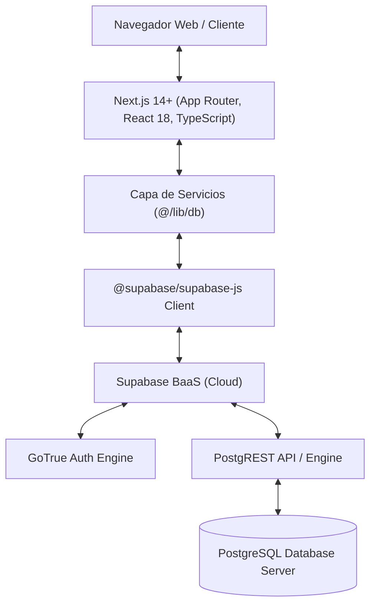
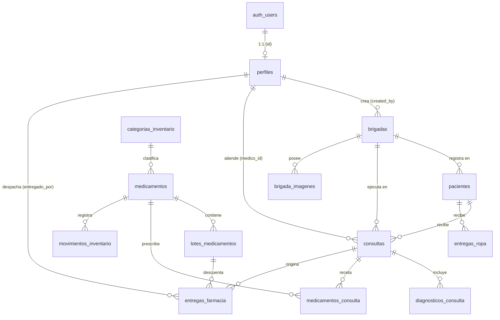
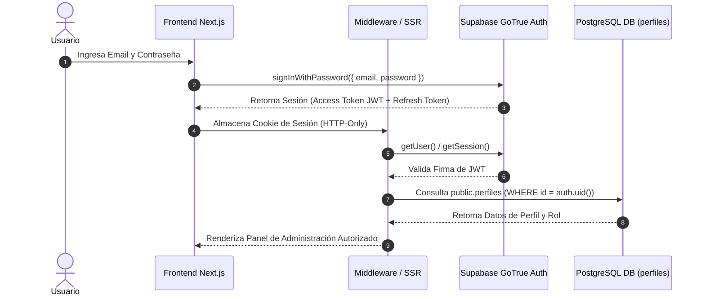
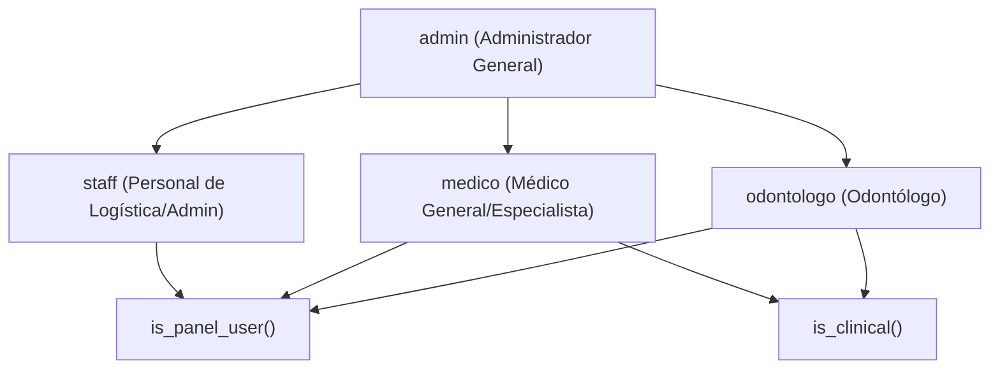
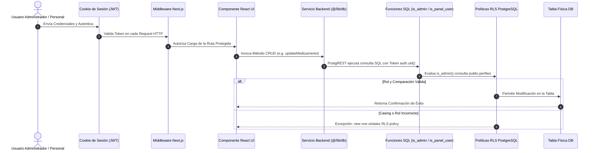
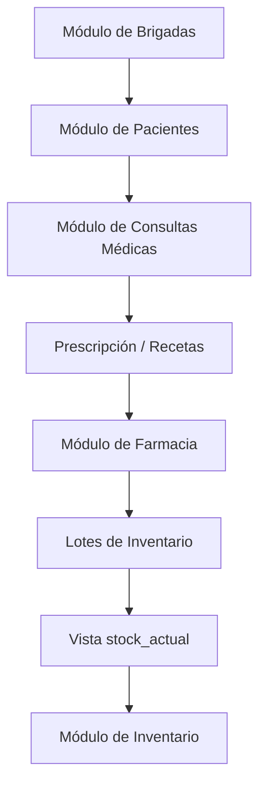
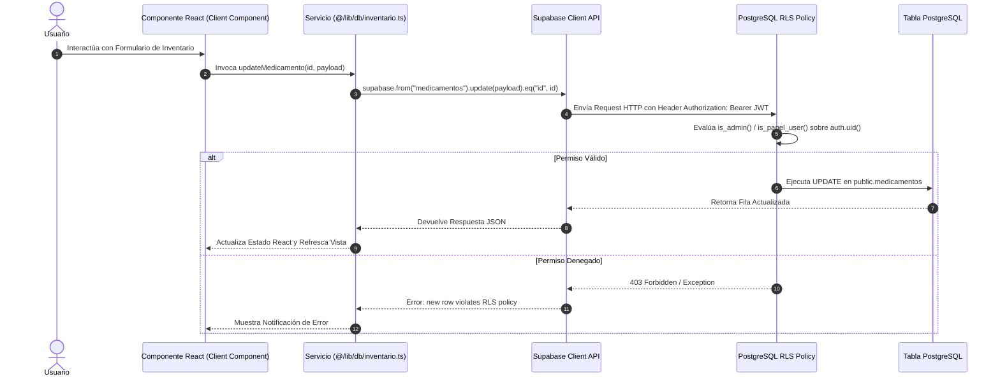

# 📖 DOCUMENTACIÓN TÉCNICA OFICIAL: ARQUITECTURA DEL SISTEMA

> **Proyecto:** Sistema de Gestión Integral - Fundación Hondureña de Ayuda Médica y Social  
> **Versión del Documento:** 1.4.0 (Oficial de Referencia para Desarrollo)  
> **Fecha de Emisión:** Julio 2026  
> **Estado:** Documento Maestro de Arquitectura, Inventario de Componentes, Matriz CRUD, Análisis de Autorizaciones y Modelo RBAC

---

## 📑 ÍNDICE GENERAL

1. [Resumen General del Proyecto](#1-resumen-general-del-proyecto)
2. [Arquitectura de la Base de Datos y Esquema de Campos](#2-arquitectura-de-la-base-de-datos-y-esquema-de-campos)
3. [Estructura DDL de Funciones SQL](#3-estructura-ddl-de-funciones-sql)
4. [Estructura DDL de Triggers Almacenados](#4-estructura-ddl-de-triggers-almacenados)
5. [Estructura DDL de Vistas Relacionales](#5-estructura-ddl-de-vistas-relacionales)
6. [Políticas de Seguridad a Nivel de Fila (RLS)](#6-políticas-de-seguridad-a-nivel-de-fila-rls)
7. [Sistema de Autenticación](#7-sistema-de-autenticación)
8. [Sistema de Roles y Autorización](#8-sistema-de-roles-y-autorización)
9. [Arquitectura del Frontend y Mapa de Navegación](#9-arquitectura-del-frontend-y-mapa-de-navegación)
10. [Inventario Completo de Componentes del Frontend](#10-inventario-completo-de-componentes-del-frontend)
11. [Inventario de Servicios y Funciones Backend](#11-inventario-de-servicios-y-funciones-backend)
12. [Matriz Técnica CRUD](#12-matriz-técnica-crud)
13. [Inventario Actual de Permisos por Módulo](#13-inventario-actual-de-permisos-por-módulo)
14. [Inventario de Rutas Protegidas](#14-inventario-de-rutas-protegidas)
15. [Diagrama de Dependencias de Autorización](#15-diagrama-de-dependencias-de-autorización)
16. [Módulos del Sistema](#16-módulos-del-sistema)
17. [Dependencias Críticas e Interacción entre Módulos](#17-dependencias-críticas-e-interacción-entre-módulos)
18. [Flujo Global de Datos](#18-flujo-global-de-datos)
19. [Inventario Técnico del Proyecto](#19-inventario-técnico-del-proyecto)
20. [Problemas de Arquitectura Detectados](#20-problemas-de-arquitectura-detectados)
21. [Preparación para el Rediseño del Sistema de Roles (Fase 2)](#21-preparación-para-el-rediseño-del-sistema-de-roles-fase-2)
22. [Modelo de Autorización](#22-modelo-de-autorización)

---

## 1. RESUMEN GENERAL DEL PROYECTO

### 1.1 Propósito del Sistema
El sistema tiene como objetivo centralizar, automatizar y auditar la operación técnica, médica y logística de la **Fundación**. Permite administrar brigadas médicas comunitarias, control de inventario de medicamentos e insumos sanitarios, atención clínica de pacientes (expediente médico y odontológico), dispensación en farmacia, donaciones, voluntariado y reportes estadísticos gerenciales.

### 1.2 Stack Tecnológico Principal



- **Frontend Core:** Next.js (App Router), TypeScript, React 18, Vanilla CSS (Design Tokens & CSS Modules).
- **Backend / BaaS:** Supabase (PostgreSQL, GoTrue Auth Engine, PostgREST API Engine, Supabase Storage Buckets).
- **Autenticación:** Supabase Auth (JWT, Cookies de Sesión HTTP-Only en SSR con `@supabase/ssr`).
- **ORM / Tipado:** Generación automática de tipos estáticos TypeScript desde el esquema PostgreSQL (`src/lib/database.types.ts`).

📌 **Referencias Cruzadas:**  
*Ver también: [Capítulo 7 (Autenticación)](#7-sistema-de-autenticación) | [Capítulo 9 (Frontend)](#9-arquitectura-del-frontend-y-mapa-de-navegación) | [Capítulo 11 (Servicios Backend)](#11-inventario-de-servicios-y-funciones-backend)*

---

## 2. ARQUITECTURA DE LA BASE DE DATOS Y ESQUEMA DE CAMPOS

### 2.1 Diagrama Entidad-Relación (ERD)



### 2.2 Diccionario Exhaustivo de Campos por Tabla

#### 1. `public.perfiles`
Información extendida del personal administrativo y médico.
- **`id`** (`uuid`, Primary Key, Foreign Key -> `auth.users.id` ON DELETE CASCADE, NOT NULL): Identificador único del usuario.
- **`nombres`** (`text`, NOT NULL): Nombres del usuario.
- **`apellidos`** (`text`, NOT NULL): Apellidos del usuario.
- **`email`** (`text`, NOT NULL): Correo electrónico institucional.
- **`rol`** (`text`, NOT NULL, Default `'staff'`): Rol en la plataforma (`'admin'`, `'staff'`, `'medico'`, `'odontologo'`).
- **`activo`** (`boolean`, NOT NULL, Default `true`): Estado de la cuenta.
- **`created_at`** (`timestamptz`, Default `now()`): Fecha de registro.
- **`updated_at`** (`timestamptz`, Default `now()`): Última actualización.

#### 2. `public.categorias_inventario`
Clasificación taxonómica de recursos de farmacia e insumos.
- **`id`** (`uuid`, Primary Key, Default `gen_random_uuid()`, NOT NULL).
- **`codigo`** (`text`, UNIQUE, NOT NULL): Código alfanumérico identificador.
- **`nombre`** (`text`, NOT NULL): Nombre comercial/categoría.
- **`descripcion`** (`text`, NULL): Descripción detallada.
- **`activo`** (`boolean`, Default `true`): Estado.
- **`created_at`** (`timestamptz`, Default `now()`).
- **`updated_at`** (`timestamptz`, Default `now()`).

#### 3. `public.medicamentos`
Catálogo físico de medicamentos, insumos médicos y material de brigada.
- **`id`** (`uuid`, Primary Key, Default `gen_random_uuid()`, NOT NULL).
- **`codigo`** (`text`, NULL): Código/SKU corto (máximo 20 caracteres en esquema).
- **`nombre`** (`text`, NOT NULL): Nombre del fármaco o insumo.
- **`descripcion`** (`text`, NULL): Posología, concentración o especificaciones.
- **`unidad_medida`** (`text`, NULL): Presentación (frascos, tabletas, cajas, tubos).
- **`stock_minimo`** (`integer`, NOT NULL, Default `10`, CHECK >= 0): Umbral de alerta para stock crítico.
- **`stock_actual`** (`integer`, NOT NULL, Default `0`, CHECK >= 0): Cantidad física residual.
- **`tipo_recurso`** (`text`, Default `'medicamento'`, CHECK `IN ('medicamento', 'insumo_medico', 'material_brigada')`).
- **`categoria_id`** (`uuid`, Foreign Key -> `public.categorias_inventario.id`, NOT NULL).
- **`brigada_id`** (`text`, Foreign Key -> `public.brigadas.id`, NULL).
- **`created_at`** (`timestamptz`, Default `now()`).
- **`updated_at`** (`timestamptz`, Default `now()`).

#### 4. `public.lotes_medicamentos`
Fuente de verdad de existencia por fechas de vencimiento y números de lote.
- **`id`** (`uuid`, Primary Key, Default `gen_random_uuid()`, NOT NULL).
- **`medicamento_id`** (`uuid`, Foreign Key -> `public.medicamentos.id` ON DELETE CASCADE, NOT NULL).
- **`numero_lote`** (`text`, NOT NULL): Código de lote asignado por fabricante o sistema.
- **`cantidad_inicial`** (`integer`, NOT NULL, CHECK >= 0): Cantidad con la que ingresó el lote.
- **`cantidad_actual`** (`integer`, NOT NULL, CHECK >= 0): Cantidad disponible actual.
- **`fecha_vencimiento`** (`date`, NOT NULL): Fecha límite de caducidad.
- **`fecha_ingreso`** (`date`, Default `CURRENT_DATE`).
- **`fabricante`** (`text`, NULL): Casa farmacéutica o proveedor.
- **`observaciones`** (`text`, NULL).
- **`created_at`** (`timestamptz`, Default `now()`).
- **`updated_at`** (`timestamptz`, Default `now()`).

#### 5. `public.movimientos_inventario`
Kárdex y bitácora de transacciones de inventario.
- **`id`** (`uuid`, Primary Key, Default `gen_random_uuid()`, NOT NULL).
- **`medicamento_id`** (`uuid`, Foreign Key -> `public.medicamentos.id`, NOT NULL).
- **`cantidad`** (`integer`, NOT NULL): Cantidad transferida.
- **`tipo`** (`text`, NOT NULL, CHECK `IN ('entrada', 'salida')`): Sentido de la transacción.
- **`motivo`** (`text`, NOT NULL): Causa de la transacción.
- **`observaciones`** (`text`, NULL).
- **`usuario_id`** (`uuid`, Foreign Key -> `public.perfiles.id`, NULL).
- **`brigada_id`** (`text`, Foreign Key -> `public.brigadas.id`, NULL).
- **`fecha_movimiento`** (`timestamptz`, Default `now()`).

#### 6. `public.brigadas`
Registro logístico de operativos comunitarios de salud.
- **`id`** (`text`, Primary Key, NOT NULL, e.g. `'BRIG-2026-001'`).
- **`codigo`** (`text`, UNIQUE, NOT NULL).
- **`nombre`** (`text`, NOT NULL).
- **`departamento`** (`text`, NOT NULL).
- **`municipio`** (`text`, NOT NULL).
- **`lugar`** (`text`, NOT NULL).
- **`fecha_brigada`** (`date`, NOT NULL).
- **`fecha_inicio_inscripcion`** (`date`, NULL).
- **`fecha_fin_inscripcion`** (`date`, NULL).
- **`capacidad_voluntarios`** (`integer`, NULL).
- **`estado`** (`text`, Default `'planeada'`, CHECK `IN ('planeada', 'activa', 'finalizada', 'cancelada')`).
- **`descripcion`** (`text`, NULL).
- **`imagen_banner`** (`text`, NULL).
- **`latitud`** (`numeric`, NULL).
- **`longitud`** (`numeric`, NULL).
- **`created_by`** (`uuid`, Foreign Key -> `public.perfiles.id`, NULL).
- **`created_at`** (`timestamptz`, Default `now()`).
- **`updated_at`** (`timestamptz`, Default `now()`).

#### 7. `public.pacientes`
Fichero unificado de pacientes.
- **`id`** (`uuid`, Primary Key, Default `gen_random_uuid()`, NOT NULL).
- **`codigo`** (`text`, UNIQUE, NOT NULL).
- **`nombres`** (`text`, NOT NULL).
- **`apellidos`** (`text`, NOT NULL).
- **`sexo`** (`text`, NOT NULL, CHECK `IN ('M', 'F')`).
- **`fecha_nacimiento`** (`date`, NULL).
- **`edad`** (`integer`, NULL).
- **`comunidad`** (`text`, NULL).
- **`telefono`** (`text`, NULL).
- **`responsable`** (`text`, NULL).
- **`brigada_id`** (`text`, Foreign Key -> `public.brigadas.id`, NULL).
- **`created_at`** (`timestamptz`, Default `now()`).
- **`updated_at`** (`timestamptz`, Default `now()`).

#### 8. `public.consultas`
Expediente de atenciones clínicas de medicina y odontología.
- **`id`** (`uuid`, Primary Key, Default `gen_random_uuid()`, NOT NULL).
- **`paciente_id`** (`uuid`, Foreign Key -> `public.pacientes.id`, NOT NULL).
- **`medico_id`** (`uuid`, Foreign Key -> `public.perfiles.id`, NOT NULL).
- **`brigada_id`** (`text`, Foreign Key -> `public.brigadas.id`, NOT NULL).
- **`tipo_consulta`** (`text`, NOT NULL, CHECK `IN ('medico', 'odontologo')`).
- **`motivo_consulta`** (`text`, NOT NULL).
- **`enfermedad_actual`** (`text`, NULL).
- **`diagnostico`** (`text`, NULL).
- **`tratamiento`** (`text`, NULL).
- **`observaciones`** (`text`, NULL).
- **`requiere_postclinica`** (`boolean`, Default `false`).
- **`created_at`** (`timestamptz`, Default `now()`).

#### 9. `public.medicamentos_consulta`
Detalle de líneas de prescripción médica en recetas.
- **`id`** (`uuid`, Primary Key, Default `gen_random_uuid()`, NOT NULL).
- **`consulta_id`** (`uuid`, Foreign Key -> `public.consultas.id` ON DELETE CASCADE, NOT NULL).
- **`medicamento_id`** (`uuid`, Foreign Key -> `public.medicamentos.id`, NOT NULL).
- **`cantidad`** (`integer`, NOT NULL, CHECK > 0).
- **`indicaciones`** (`text`, NULL).

#### 10. `public.entregas_farmacia`
Historial de dispensación física en ventanilla de farmacia.
- **`id`** (`uuid`, Primary Key, Default `gen_random_uuid()`, NOT NULL).
- **`consulta_id`** (`uuid`, Foreign Key -> `public.consultas.id`, NOT NULL).
- **`medicamento_id`** (`uuid`, Foreign Key -> `public.medicamentos.id`, NOT NULL).
- **`lote_id`** (`uuid`, Foreign Key -> `public.lotes_medicamentos.id`, NOT NULL).
- **`cantidad`** (`integer`, NOT NULL, CHECK > 0).
- **`entregado_por`** (`uuid`, Foreign Key -> `public.perfiles.id`, NOT NULL).
- **`observaciones`** (`text`, NULL).
- **`fecha_entrega`** (`timestamptz`, Default `now()`).

📌 **Referencias Cruzadas:**  
*Ver también: [Capítulo 5 (Vistas Relacionales)](#5-estructura-ddl-de-vistas-relacionales) | [Capítulo 12 (Matriz CRUD)](#12-matriz-técnica-crud)*

---

## 3. ESTRUCTURA DDL DE FUNCIONES SQL

### 3.1 Código Fuente SQL Exacto de Funciones

```sql
-- 1. get_user_role()
CREATE OR REPLACE FUNCTION public.get_user_role()
RETURNS text LANGUAGE sql STABLE SECURITY DEFINER SET search_path = public AS $$
  SELECT rol::text FROM public.perfiles WHERE id = auth.uid();
$$;

-- 2. has_role()
CREATE OR REPLACE FUNCTION public.has_role(required_role text)
RETURNS boolean LANGUAGE sql STABLE SECURITY DEFINER SET search_path = public AS $$
  SELECT EXISTS (
    SELECT 1 FROM public.perfiles
    WHERE id = auth.uid() AND rol::text = required_role
  );
$$;

-- 3. has_any_role()
CREATE OR REPLACE FUNCTION public.has_any_role(required_roles text[])
RETURNS boolean LANGUAGE sql STABLE SECURITY DEFINER SET search_path = public AS $$
  SELECT EXISTS (
    SELECT 1 FROM public.perfiles
    WHERE id = auth.uid() AND rol::text = ANY(required_roles)
  );
$$;

-- 4. is_admin()
CREATE OR REPLACE FUNCTION public.is_admin()
RETURNS boolean LANGUAGE sql STABLE SECURITY DEFINER SET search_path = public AS $$
  SELECT public.has_role('admin');
$$;

-- 5. is_panel_user()
CREATE OR REPLACE FUNCTION public.is_panel_user()
RETURNS boolean LANGUAGE sql STABLE SECURITY DEFINER SET search_path = public AS $$
  SELECT public.has_any_role(ARRAY['admin', 'staff', 'medico', 'odontologo']);
$$;

-- 6. is_clinical()
CREATE OR REPLACE FUNCTION public.is_clinical()
RETURNS boolean LANGUAGE sql STABLE SECURITY DEFINER SET search_path = public AS $$
  SELECT public.has_any_role(ARRAY['medico', 'odontologo']);
$$;
```

📌 **Referencias Cruzadas:**  
*Ver también: [Capítulo 6 (Políticas RLS)](#6-políticas-de-seguridad-a-nivel-de-fila-rls) | [Capítulo 8 (Sistema de Roles)](#8-sistema-de-roles-y-autorización) | [Capítulo 15 (Dependencias de Autorización)](#15-diagrama-de-dependencias-de-autorización)*

---

## 4. ESTRUCTURA DDL DE TRIGGERS ALMACENADOS

```sql
-- 1. Trigger de Creación Automática de Perfil (on_auth_user_created)
CREATE OR REPLACE FUNCTION public.handle_new_user()
RETURNS trigger LANGUAGE plpgsql SECURITY DEFINER SET search_path = public AS $$
BEGIN
  INSERT INTO public.perfiles (id, nombres, apellidos, email, rol)
  VALUES (
    new.id,
    COALESCE(new.raw_user_meta_data->>'nombres', 'Usuario'),
    COALESCE(new.raw_user_meta_data->>'apellidos', 'Nuevo'),
    new.email,
    COALESCE(new.raw_user_meta_data->>'rol', 'staff')
  );
  RETURN new;
END;
$$;

CREATE TRIGGER on_auth_user_created
  AFTER INSERT ON auth.users
  FOR EACH ROW EXECUTE FUNCTION public.handle_new_user();

-- 2. Trigger de Timestamps updated_at
CREATE OR REPLACE FUNCTION public.update_timestamp()
RETURNS trigger LANGUAGE plpgsql AS $$
BEGIN
  NEW.updated_at = now();
  RETURN NEW;
END;
$$;

CREATE TRIGGER set_perfiles_updated_at BEFORE UPDATE ON public.perfiles FOR EACH ROW EXECUTE FUNCTION public.update_timestamp();
CREATE TRIGGER set_medicamentos_updated_at BEFORE UPDATE ON public.medicamentos FOR EACH ROW EXECUTE FUNCTION public.update_timestamp();
CREATE TRIGGER set_lotes_updated_at BEFORE UPDATE ON public.lotes_medicamentos FOR EACH ROW EXECUTE FUNCTION public.update_timestamp();
CREATE TRIGGER set_brigadas_updated_at BEFORE UPDATE ON public.brigadas FOR EACH ROW EXECUTE FUNCTION public.update_timestamp();
CREATE TRIGGER set_pacientes_updated_at BEFORE UPDATE ON public.pacientes FOR EACH ROW EXECUTE FUNCTION public.update_timestamp();
```

📌 **Referencias Cruzadas:**  
*Ver también: [Capítulo 2 (Tablas)](#2-arquitectura-de-la-base-de-datos-y-esquema-de-campos) | [Capítulo 7 (Autenticación)](#7-sistema-de-autenticación)*

---

## 5. ESTRUCTURA DDL DE VISTAS RELACIONALES

```sql
CREATE OR REPLACE VIEW public.stock_actual AS
SELECT 
  m.id AS medicamento_id,
  m.codigo,
  m.nombre,
  m.descripcion,
  m.unidad_medida,
  m.stock_minimo,
  m.tipo_recurso,
  m.categoria_id,
  COALESCE(SUM(l.cantidad_actual), m.stock_actual) AS stock_total,
  CASE 
    WHEN COALESCE(SUM(l.cantidad_actual), m.stock_actual) <= 0 THEN 'Sin Existencias'
    WHEN COALESCE(SUM(l.cantidad_actual), m.stock_actual) <= m.stock_minimo THEN 'Stock Crítico'
    ELSE 'Normal'
  END AS estado_stock
FROM public.medicamentos m
LEFT JOIN public.lotes_medicamentos l ON l.medicamento_id = m.id
GROUP BY m.id, m.codigo, m.nombre, m.descripcion, m.unidad_medida, m.stock_minimo, m.tipo_recurso, m.categoria_id, m.stock_actual;

GRANT SELECT ON public.stock_actual TO authenticated;
```

📌 **Referencias Cruzadas:**  
*Ver también: [Capítulo 12 (Matriz CRUD)](#12-matriz-técnica-crud) | [Capítulo 16 (Módulo Inventario)](#16-módulos-del-sistema)*

---

## 6. POLÍTICAS DE SEGURIDAD A NIVEL DE FILA (RLS)

```sql
-- 1. Tabla public.medicamentos
ALTER TABLE public.medicamentos ENABLE ROW LEVEL SECURITY;
CREATE POLICY "Panel read medicamentos" ON public.medicamentos FOR SELECT TO authenticated USING (public.has_any_role(ARRAY['admin', 'staff', 'medico', 'odontologo']));
CREATE POLICY "Admin insert medicamentos" ON public.medicamentos FOR INSERT TO authenticated WITH CHECK (public.is_admin());
CREATE POLICY "Admin update medicamentos" ON public.medicamentos FOR UPDATE TO authenticated USING (public.is_admin()) WITH CHECK (public.is_admin());
CREATE POLICY "Admin delete medicamentos" ON public.medicamentos FOR DELETE TO authenticated USING (public.is_admin());

-- 2. Tabla public.lotes_medicamentos
ALTER TABLE public.lotes_medicamentos ENABLE ROW LEVEL SECURITY;
CREATE POLICY "Panel read lotes" ON public.lotes_medicamentos FOR SELECT TO authenticated USING (public.is_panel_user());
CREATE POLICY "Panel insert lotes" ON public.lotes_medicamentos FOR INSERT TO authenticated WITH CHECK (public.is_panel_user());
CREATE POLICY "Panel update lotes" ON public.lotes_medicamentos FOR UPDATE TO authenticated USING (public.is_panel_user()) WITH CHECK (public.is_panel_user());
CREATE POLICY "Admin delete lotes" ON public.lotes_medicamentos FOR DELETE TO authenticated USING (public.is_admin());

-- 3. Tabla public.movimientos_inventario
ALTER TABLE public.movimientos_inventario ENABLE ROW LEVEL SECURITY;
CREATE POLICY "Panel read movimientos_inventario" ON public.movimientos_inventario FOR SELECT TO authenticated USING (public.is_panel_user());
CREATE POLICY "Panel insert movimientos_inventario" ON public.movimientos_inventario FOR INSERT TO authenticated WITH CHECK (public.is_panel_user());
```

📌 **Referencias Cruzadas:**  
*Ver también: [Capítulo 3 (Funciones SQL)](#3-estructura-ddl-de-funciones-sql) | [Capítulo 13 (Inventario de Permisos)](#13-inventario-actual-de-permisos-por-módulo) | [Capítulo 20 (Problemas RLS)](#20-problemas-de-arquitectura-detectados)*

---

## 7. SISTEMA DE AUTENTICACIÓN



📌 **Referencias Cruzadas:**  
*Ver también: [Capítulo 8 (Roles)](#8-sistema-de-roles-y-autorización) | [Capítulo 14 (Rutas Protegidas)](#14-inventario-de-rutas-protegidas)*

---

## 8. SISTEMA DE ROLES Y AUTORIZACIÓN



📌 **Referencias Cruzadas:**  
*Ver también: [Capítulo 3 (Funciones SQL)](#3-estructura-ddl-de-funciones-sql) | [Capítulo 13 (Permisos por Módulo)](#13-inventario-actual-de-permisos-por-módulo) | [Capítulo 22 (Modelo RBAC)](#22-modelo-de-autorización)*

---

## 9. ARQUITECTURA DEL FRONTEND Y MAPA DE NAVEGACIÓN

### 9.1 Mapa Estructurado de Rutas del Sistema

```
Fundación Web (Root Application)
├── / (Página de Inicio Pública)
├── /sobre-nosotros (Información Institucional)
├── /nuestro-trabajo (Operativos y Programas)
├── /brigadas (Catálogo Público de Brigadas y Voluntariado)
├── /donar (Pasarela / Formulario de Donaciones)
├── /contacto (Mensajería Pública)
├── /auth
│   └── /login (Autenticación de Personal y Médicos)
└── /administracion (Panel Privado Protegido)
    ├── Dashboard General (/administracion)
    ├── /inventario (Gestión de Medicamentos, Insumos y Materiales)
    ├── /farmacia (Prescripción y Despacho en Ventanilla FEFO)
    ├── /pacientes (Expediente Unificado de Pacientes)
    │   └── /nuevo (Registro Clínico de Nuevo Paciente)
    ├── /brigadas (Planificación y Ejecución de Brigadas)
    ├── /reportes (Cuadros de Mando Estadísticos y Gerenciales)
    ├── /usuarios (Administración de Perfiles y Roles)
    ├── /donaciones (Control de Donaciones de Ropa y Especies)
    ├── /voluntarios (Aprobación y Asignación de Voluntariado)
    ├── /actividades-infantiles (Atención y Recreación Infantil)
    ├── /ventas (Control de Presupuestos y Ventas a Beneficio)
    ├── /perfil (Ajustes de Cuenta de Usuario Authenticated)
    └── /no-autorizado (Pantalla de Restricción de Permisos)
```

📌 **Referencias Cruzadas:**  
*Ver también: [Capítulo 10 (Componentes Frontend)](#10-inventario-completo-de-componentes-del-frontend) | [Capítulo 14 (Rutas Protegidas)](#14-inventario-de-rutas-protegidas)*

---

## 10. INVENTARIO COMPLETO DE COMPONENTES DEL FRONTEND

#### 1. `MedicamentoForm`
- **Ubicación:** `src/app/administracion/inventario/components/MedicamentoForm.tsx`
- **Propósito:** Formulario modal de creación y edición de medicamentos, insumos y materiales.
- **Página donde se utiliza:** `/administracion/inventario` (`InventarioClient.tsx`).
- **Servicios que consume:** `createMedicamento()`, `updateMedicamento()`.
- **Tablas que consulta:** `public.medicamentos`, `public.categorias_inventario`.
- **Dependencias:** `InventarioClient.tsx`.

#### 2. `LotesModal`
- **Ubicación:** `src/app/administracion/inventario/components/LotesModal.tsx`
- **Propósito:** Ventana emergente para visualizar, agregar y editar lotes por fecha de vencimiento.
- **Página donde se utiliza:** `/administracion/inventario` (`InventarioClient.tsx`).
- **Servicios que consume:** `getLotesByMedicamento()`, `createLote()`, `updateLote()`, `deleteLote()`.
- **Tablas que consulta:** `public.lotes_medicamentos`.
- **Dependencias:** `InventarioClient.tsx`, `LoteForm.tsx`.

#### 3. `LoteForm`
- **Ubicación:** `src/app/administracion/inventario/components/LoteForm.tsx`
- **Propósito:** Formulario secundario para ingreso de nuevo lote con fecha de caducidad.
- **Página donde se utiliza:** `/administracion/inventario` (dentro de `LotesModal.tsx`).
- **Servicios que consume:** Invoca callback `onSubmit` de `LotesModal`.
- **Tablas que consulta:** `public.lotes_medicamentos`.
- **Dependencias:** `LotesModal.tsx`.

#### 4. `InventarioClient`
- **Ubicación:** `src/app/administracion/inventario/InventarioClient.tsx`
- **Propósito:** Vista principal del módulo de inventario con filtros por tipo y tabla interactiva.
- **Página donde se utiliza:** `/administracion/inventario/page.tsx`.
- **Servicios que consume:** `getMedicamentos()`, `getCategoriasInventario()`, `createMedicamento()`, `updateMedicamento()`.
- **Tablas que consulta:** `public.stock_actual`, `public.categorias_inventario`.
- **Dependencias:** `MedicamentoForm.tsx`, `LotesModal.tsx`.

#### 5. `FarmaciaClient`
- **Ubicación:** `src/app/administracion/farmacia/FarmaciaClient.tsx`
- **Propósito:** Interfaz de ventanilla de farmacia para dispensación FEFO y entrega manual de recetas.
- **Página donde se utiliza:** `/administracion/farmacia/page.tsx`.
- **Servicios que consume:** `getConsultasConReceta()`, `getSugerenciaLoteFEFO()`, `registrarEntregaManual()`.
- **Tablas que consulta:** `public.consultas`, `public.entregas_farmacia`, `public.lotes_medicamentos`.
- **Dependencias:** Ninguna (Componente Autónomo).

#### 6. `StockMinimo`
- **Ubicación:** `src/app/administracion/reportes/components/StockMinimo.tsx`
- **Propósito:** Widget de reporte visual con alertas de insumos en nivel crítico o agotado.
- **Página donde se utiliza:** `/administracion/reportes` (`ReportesClient.tsx`).
- **Servicios que consume:** Directo a Supabase `from("stock_actual")`.
- **Tablas que consulta:** `public.stock_actual`.
- **Dependencias:** `ReportesClient.tsx`.

#### 7. `ResumenInsumos`
- **Ubicación:** `src/app/administracion/reportes/components/ResumenInsumos.tsx`
- **Propósito:** Gráficos y tablas estadísticas de rotación e inventario de insumos.
- **Página donde se utiliza:** `/administracion/reportes` (`ReportesClient.tsx`).
- **Servicios que consume:** Directo a Supabase `from("movimientos_inventario")`.
- **Tablas que consulta:** `public.movimientos_inventario`, `public.medicamentos`.
- **Dependencias:** `ReportesClient.tsx`.

📌 **Referencias Cruzadas:**  
*Ver también: [Capítulo 9 (Frontend)](#9-arquitectura-del-frontend-y-mapa-de-navegación) | [Capítulo 11 (Servicios Backend)](#11-inventario-de-servicios-y-funciones-backend)*

---

## 11. INVENTARIO DE SERVICIOS Y FUNCIONES BACKEND

### 11.1 Mapeo de Librerías (`src/lib/db/*`)

#### 1. `src/lib/db/inventario.ts`
- **Funciones Exportadas:**
  - `getMedicamentos(tipoRecurso)`: Consulta `public.stock_actual`.
  - `getCategoriasInventario()`: Consulta `public.categorias_inventario`.
  - `createMedicamento(medicamento, cantidadInicial)`: Inserta en `public.medicamentos` y crea lote inicial.
  - `updateMedicamento(id, medicamento)`: Ejecuta `UPDATE` en `public.medicamentos` (con fallback `upsert`).
  - `deleteMedicamento(id)`: Ejecuta `DELETE` en `public.medicamentos`.
  - `getLotesByMedicamento(medicamentoId)`: Consulta `public.lotes_medicamentos`.
  - `createLote(lote)`: Inserta en `public.lotes_medicamentos` y registra movimiento en `movimientos_inventario`.
  - `updateLote(id, lote)`: Ejecuta `UPDATE` en `public.lotes_medicamentos`.
  - `deleteLote(id)`: Ejecuta `DELETE` en `public.lotes_medicamentos`.
- **Tablas Utilizadas:** `medicamentos`, `lotes_medicamentos`, `movimientos_inventario`, `categorias_inventario`, `stock_actual`.
- **Consumidores:** `InventarioClient.tsx`, `MedicamentoForm.tsx`, `LotesModal.tsx`.

#### 2. `src/lib/db/farmacia.ts`
- **Funciones Exportadas:**
  - `getConsultasConReceta()`: Obtiene consultas con medicamentos pendientes.
  - `getSugerenciaLoteFEFO(medicamentoId)`: Consulta el lote más próximo a vencer en `public.lotes_medicamentos`.
  - `registrarEntregaManual(data)`: Descuenta de `lotes_medicamentos`, inserta en `entregas_farmacia` y `movimientos_inventario`.
- **Tablas Utilizadas:** `consultas`, `medicamentos_consulta`, `entregas_farmacia`, `lotes_medicamentos`, `movimientos_inventario`.
- **Consumidores:** `FarmaciaClient.tsx`.

#### 3. `src/lib/db/pacientes.ts`
- **Funciones Exportadas:**
  - `getPacientes()`, `createPaciente()`, `updatePaciente()`, `getHistorialPaciente()`.
- **Tablas Utilizadas:** `pacientes`, `consultas`, `diagnosticos_consulta`.
- **Consumidores:** `PacientesClient.tsx`.

#### 4. `src/lib/db/brigadas.ts`
- **Funciones Exportadas:**
  - `getBrigadas()`, `createBrigada()`, `updateBrigada()`, `deleteBrigada()`.
- **Tablas Utilizadas:** `brigadas`, `brigada_imagenes`, `perfiles`.
- **Consumidores:** `BrigadasClient.tsx`.

📌 **Referencias Cruzadas:**  
*Ver también: [Capítulo 10 (Componentes)](#10-inventario-completo-de-componentes-del-frontend) | [Capítulo 12 (Matriz CRUD)](#12-matriz-técnica-crud)*

---

## 12. MATRIZ TÉCNICA CRUD

| Tabla | Create (C) | Read (R) | Update (U) | Delete (D) | Vista Relacionada | Servicio / Librería Consumidora | Módulo Consumidor |
|---|:---:|:---:|:---:|:---:|---|---|---|
| `medicamentos` | `createMedicamento` | `getMedicamentos` | `updateMedicamento` | `deleteMedicamento` | `stock_actual` | `src/lib/db/inventario.ts` | Inventario |
| `lotes_medicamentos` | `createLote` | `getLotesByMedicamento` | `updateLote` | `deleteLote` | `stock_actual` | `src/lib/db/inventario.ts` | Inventario / Farmacia |
| `movimientos_inventario` | `createLote`/`registrarEntrega` | Directo DB | N/A (Append-Only) | N/A | N/A | `inventario.ts` / `farmacia.ts` | Inventario / Reportes |
| `categorias_inventario` | Directo DB | `getCategoriasInventario` | Directo DB | Directo DB | N/A | `src/lib/db/inventario.ts` | Inventario |
| `pacientes` | `createPaciente` | `getPacientes` | `updatePaciente` | Directo DB | `v_pacientes_atendidos` | `src/lib/db/pacientes.ts` | Pacientes |
| `consultas` | `createConsulta` | `getConsultas` | Directo DB | N/A | N/A | `src/lib/db/pacientes.ts` | Pacientes / Farmacia |
| `entregas_farmacia` | `registrarEntregaManual` | `getEntregas` | N/A | N/A | `v_entregas_farmacia` | `src/lib/db/farmacia.ts` | Farmacia / Reportes |
| `brigadas` | `createBrigada` | `getBrigadas` | `updateBrigada` | `deleteBrigada` | `dashboard_brigadas` | `src/lib/db/brigadas.ts` | Brigadas |
| `perfiles` | Trigger Auth | Directo DB | Directo DB | Trigger Auth | N/A | `src/lib/auth/roles.ts` | Usuarios / Autenticación |

📌 **Referencias Cruzadas:**  
*Ver también: [Capítulo 2 (Tablas)](#2-arquitectura-de-la-base-de-datos-y-esquema-de-campos) | [Capítulo 11 (Servicios)](#11-inventario-de-servicios-y-funciones-backend)*

---

## 13. INVENTARIO ACTUAL DE PERMISOS POR MÓDULO

### 1. Módulo de Inventario
- **Frontend:** Comprueba sesión activa; filtra vistas por tipo de recurso (`medicamentos`, `insumos`, `brigada`).
- **Backend (`src/lib/db/inventario.ts`):** `getMedicamentos()`, `createMedicamento()`, `updateMedicamento()`, `deleteMedicamento()`.
- **Base de Datos & RLS:**
  - Tabla: `public.medicamentos`.
  - Función SQL RLS: `public.is_admin()`, `public.has_any_role(...)`.
  - Políticas RLS: `"Panel read medicamentos"` (SELECT para panel), `"Admin update medicamentos"` (UPDATE solo admin).

### 2. Módulo de Farmacia
- **Frontend:** Comprueba sesión activa; muestra dispensador FEFO y alertas de vencimiento.
- **Backend (`src/lib/db/farmacia.ts`):** `getConsultasConReceta()`, `getSugerenciaLoteFEFO()`, `registrarEntregaManual()`.
- **Base de Datos & RLS:**
  - Tablas: `entregas_farmacia`, `lotes_medicamentos`, `movimientos_inventario`.
  - Función SQL RLS: `public.is_panel_user()`.
  - Políticas RLS: `"Panel insert lotes"`, `"Panel insert movimientos_inventario"`.

### 3. Módulo de Pacientes y Consultas
- **Frontend:** Muestra expediente clínico; restringe creación de atenciones a profesionales clínicos.
- **Backend (`src/lib/db/pacientes.ts`):** `createPaciente()`, `createConsulta()`.
- **Base de Datos & RLS:**
  - Tablas: `pacientes`, `consultas`, `atenciones_pacientes`.
  - Función SQL RLS: `public.is_clinical()`, `public.is_panel_user()`.
  - Políticas RLS: `"Clinical insert own atenciones"`.

📌 **Referencias Cruzadas:**  
*Ver también: [Capítulo 6 (RLS)](#6-políticas-de-seguridad-a-nivel-de-fila-rls) | [Capítulo 8 (Roles)](#8-sistema-de-roles-y-autorización) | [Capítulo 22 (Modelo RBAC)](#22-modelo-de-autorización)*

---

## 14. INVENTARIO DE RUTAS PROTEGIDAS

| Ruta | Componente Cliente | Protección Aplicada | Rol Requerido Actualmente | Middleware / Handler |
|---|---|---|---|---|
| `/administracion` | `DashboardClient.tsx` | Autenticación + Cookie | `admin`, `staff`, `medico`, `odontologo` | `@/middleware.ts` |
| `/administracion/inventario` | `InventarioClient.tsx` | Autenticación + RLS DB | `is_panel_user()` (SELECT) / `is_admin()` (UPDATE) | `@/middleware.ts` |
| `/administracion/farmacia` | `FarmaciaClient.tsx` | Autenticación + RLS DB | `is_panel_user()` | `@/middleware.ts` |
| `/administracion/pacientes` | `PacientesClient.tsx` | Autenticación + RLS DB | `is_panel_user()` | `@/middleware.ts` |
| `/administracion/brigadas` | `BrigadasClient.tsx` | Autenticación + RLS DB | `is_admin()` / `is_panel_user()` | `@/middleware.ts` |
| `/administracion/usuarios` | `UsuariosClient.tsx` | Autenticación Estricta | `admin` | `@/middleware.ts` |
| `/administracion/reportes` | `ReportesClient.tsx` | Autenticación | `admin`, `staff` | `@/middleware.ts` |

📌 **Referencias Cruzadas:**  
*Ver también: [Capítulo 7 (Autenticación)](#7-sistema-de-autenticación) | [Capítulo 9 (Mapa de Navegación)](#9-arquitectura-del-frontend-y-mapa-de-navegación)*

---

## 15. DIAGRAMA DE DEPENDENCIAS DE AUTORIZACIÓN



📌 **Referencias Cruzadas:**  
*Ver también: [Capítulo 3 (Funciones SQL)](#3-estructura-ddl-de-funciones-sql) | [Capítulo 6 (RLS)](#6-políticas-de-seguridad-a-nivel-de-fila-rls) | [Capítulo 22 (Modelo de Autorización RBAC)](#22-modelo-de-autorización)*

---

## 16. MÓDULOS DEL SISTEMA

| Módulo | Propósito Principal | Tablas Principales Utilizadas | Servicios Asociados |
|---|---|---|---|
| **Inventario** | Control de existencias, medicamentos, insumos y lotes | `medicamentos`, `lotes_medicamentos`, `stock_actual`, `categorias_inventario` | `src/lib/db/inventario.ts` |
| **Farmacia** | Prescripción, sugerencias FEFO y dispensación en ventanilla | `entregas_farmacia`, `medicamentos_consulta`, `consultas` | `src/lib/db/farmacia.ts` |
| **Pacientes & Consulta** | Expediente clínico, historial médico y atenciones de brigada | `pacientes`, `consultas`, `diagnosticos_consulta` | `src/lib/db/pacientes.ts` |
| **Brigadas** | Logística, inscripciones comunitarias y mapas de atención | `brigadas`, `brigada_imagenes`, `voluntarios` | `src/lib/db/brigadas.ts` |
| **Reportes & Analytics** | Cuadros de mando gerenciales, alertas de stock y consumo | `stock_actual`, `entregas_farmacia`, `atenciones_pacientes` | Integrados en componentes |

📌 **Referencias Cruzadas:**  
*Ver también: [Capítulo 10 (Componentes)](#10-inventario-completo-de-componentes-del-frontend) | [Capítulo 17 (Dependencias Críticas)](#17-dependencias-críticas-e-interacción-entre-módulos)*

---

## 17. DEPENDENCIAS CRÍTICAS E INTERACCIÓN ENTRE MÓDULOS



### 17.1 Análisis de Impacto por Modificación de Módulo

1. **Módulo de Inventario (`medicamentos` / `lotes_medicamentos`):**
   - **Dependencias:** Consumido por Farmacia, Consultas Médicas y Reportes.
   - **Impacto de Modificación:** **CRÍTICO.** Cambios en el esquema de `medicamentos` o `lotes_medicamentos` rompen la vista `stock_actual`, las sugerencias FEFO de farmacia y la prescripción clínica.

2. **Módulo de Consultas y Pacientes (`pacientes` / `consultas`):**
   - **Dependencias:** Origina las recetas para Farmacia y estadísticas de Brigadas.
   - **Impacto de Modificación:** **ALTO.** Alterar la estructura de `consultas` afecta la dispensación de medicamentos.

📌 **Referencias Cruzadas:**  
*Ver también: [Capítulo 12 (Matriz CRUD)](#12-matriz-técnica-crud) | [Capítulo 16 (Módulos del Sistema)](#16-módulos-del-sistema)*

---

## 18. FLUJO GLOBAL DE DATOS



📌 **Referencias Cruzadas:**  
*Ver también: [Capítulo 11 (Servicios)](#11-inventario-de-servicios-y-funciones-backend) | [Capítulo 15 (Dependencias Autorización)](#15-diagrama-de-dependencias-de-autorización)*

---

## 19. INVENTARIO TÉCNICO DEL PROYECTO

- **Total de Tablas Físicas:** 15 tablas en esquema `public`.
- **Total de Vistas Relacionales:** 4 vistas (`stock_actual`, `v_pacientes_atendidos`, `v_entregas_farmacia`, `dashboard_farmacia`).
- **Total de Funciones Almacenadas SQL:** 6 funciones principales de autorización y helpers.
- **Total de Servicios Backend:** 9 archivos de servicio en `@/lib/db/`.
- **Total de Rutas de Administración:** 14 módulos de interfaz en Next.js App Router.
- **Total de Componentes UI Principales:** 12 componentes cliente especializados.

📌 **Referencias Cruzadas:**  
*Ver también: [Capítulo 10 (Componentes)](#10-inventario-completo-de-componentes-del-frontend) | [Capítulo 11 (Servicios)](#11-inventario-de-servicios-y-funciones-backend)*

---

## 20. PROBLEMAS DE ARQUITECTURA DETECTADOS

> [!WARNING]
> **SECCIÓN DE EVALUACIÓN TÉCNICA - SOLO DOCUMENTACIÓN Y AUDITORÍA**

### 1. Inconsistencias en el Sistema de Roles
- **Desacoplamiento de Casing/Strings:** La función `has_role('admin')` realiza una comparación rígida de texto `rol::text = 'admin'`. Si el campo `rol` en `public.perfiles` contiene letras mayúsculas (por ejemplo `'ADMIN'` o `'ADMINISTRADOR'`), la comparación falla silenciosamente y la función `is_admin()` devuelve `FALSE`.
- **Desincronización de Funciones Helper:** La función `is_panel_user()` no fue actualizada en la migración de parches `20260705000002_fix_role_functions.sql`, heredando una evaluación previa desalineada.

### 2. Desalineación de Políticas RLS entre Tablas Relacionadas
- **Conflicto Inventario-Farmacia:** El personal de farmacia o logística (`staff`) tiene permisos RLS para descontar de `lotes_medicamentos` e insertar en `movimientos_inventario`, pero la tabla `medicamentos` restringe la actualización únicamente a `is_admin()`, generando fallos al editar registros desde vistas integradas.

### 3. Redundancia de Propiedades de Identificador en Vistas
- La vista `public.stock_actual` retorna la clave primaria bajo el alias `medicamento_id`, mientras que las funciones CRUD de componentes cliente esperan la propiedad `id`, requiriendo mapeos defensivos manuales en el frontend (`selectedMed.medicamento_id || selectedMed.id`).

📌 **Referencias Cruzadas:**  
*Ver también: [Capítulo 6 (RLS)](#6-políticas-de-seguridad-a-nivel-de-fila-rls) | [Capítulo 21 (Rediseño Fase 2)](#21-preparación-para-el-rediseño-del-sistema-de-roles-fase-2) | [Capítulo 22 (Modelo RBAC)](#22-modelo-de-autorización)*

---

## 21. PREPARACIÓN PARA EL REDISEÑO DEL SISTEMA DE ROLES (FASE 2)

### Pautas para la Siguiente Fase:

1. **Estandarización del Tipo Enum de Roles:**  
   Definir una enumeración canónica en PostgreSQL para los roles del sistema (`'admin'`, `'staff'`, `'medico'`, `'odontologo'`) e implementar comparaciones insensibles a mayúsculas (`LOWER(rol::text) = LOWER(required_role)`).

2. **Unificación del Modelo RLS por Módulo:**  
   Reestructurar las políticas RLS para que todas las tablas pertenecientes a un mismo dominio funcional (por ejemplo, el dominio de Inventario: `medicamentos`, `lotes_medicamentos`, `movimientos_inventario`) compartan exactamente la misma regla de autorización de entrada y edición (`is_panel_user()` o `has_any_role(...)`).

3. **Matriz Única de Autorización:**  
   Implementar una matriz de permisos centralizada que sirva de estándar para futuras expansiones de la plataforma sin requerir parches individuales por tabla.

📌 **Referencias Cruzadas:**  
*Ver también: [Capítulo 8 (Roles)](#8-sistema-de-roles-y-autorización) | [Capítulo 13 (Permisos por Módulo)](#13-inventario-actual-de-permisos-por-módulo) | [Capítulo 20 (Problemas Detectados)](#20-problemas-de-arquitectura-detectados) | [Capítulo 22 (Modelo RBAC)](#22-modelo-de-autorización)*

---

## 22. MODELO DE AUTORIZACIÓN

### 22.1 Objetivo
Documentar que el sistema implementará un modelo de **Control de Acceso Basado en Roles (RBAC - Role-Based Access Control)** para controlar el acceso a módulos, rutas y acciones del sistema.

Los permisos definidos en este modelo serán la base fundamental para:
- **Protección de rutas** en el frontend (Middleware y Layouts de Next.js).
- **Menú lateral de navegación** (visibilidad dinámica de opciones).
- **Acciones disponibles** en interfaz de usuario (botones, formularios y acciones CRUD).
- **Políticas de Seguridad a Nivel de Fila (RLS)** en PostgreSQL/Supabase.
- **Validaciones del backend** y capa de servicios.

### 22.2 Roles Oficiales del Sistema

El sistema se regirá exclusivamente por los siguientes **5 roles oficiales**:

#### 1. Administrador
- Responsable de la administración completa del sistema.
- Incluye el acceso utilizado por la **Dirección General**.
- Tiene acceso completo a todos los módulos y configuraciones del sistema.

#### 2. Coordinador
- Responsable de la planificación y supervisión de las brigadas médicas.
- Administra las brigadas y supervisa el funcionamiento de los demás módulos mediante permisos de consulta o administración según corresponda.

#### 3. Atención de Pacientes
- Rol utilizado por **médicos** y **odontólogos**.
- Responsable de:
  - Registro del paciente durante la atención.
  - Consultas clínicas.
  - Diagnósticos.
  - Historial clínico.
  - Emisión de recetas médicas.
- Puede consultar el estado de despacho de medicamentos desde el módulo de Farmacia.

#### 4. Encargado de Farmacia
- Responsable de la dispensación de medicamentos.
- Gestiona la entrega física de medicamentos y registra los despachos realizados durante las brigadas.

#### 5. Encargado de Bodega
- Responsable del módulo de Inventario.
- Gestiona:
  - Catálogo de inventario.
  - Existencias físicas.
  - Movimientos de entrada.
  - Movimientos de salida.
  - Lotes de medicamentos.
  - Fechas de vencimiento.

### 22.3 Definición de Niveles de Acceso

- **`CRUD`**: Crear, consultar, actualizar y eliminar información completa en el módulo.
- **`R`**: Consulta completa del módulo sin posibilidad de modificar información (solo-lectura).
- **`P`**: Consulta limitada a la información propia o relacionada con las funciones operativas del usuario (procesar/operar).
- **`—`**: Sin acceso al módulo.

### 22.4 Matriz Oficial de Permisos

| Módulo | Administrador | Coordinador | Atención de Pacientes | Farmacia | Bodega |
|---|:---:|:---:|:---:|:---:|:---:|
| **Inventario** | **CRUD** | **R** | **—** | **R** | **CRUD** |
| **Farmacia** | **CRUD** | **R** | **P** | **CRUD** | **R** |
| **Pacientes y Consultas** | **CRUD** | **R** | **CRUD** | **R** | **—** |
| **Brigadas Médicas** | **CRUD** | **CRUD** | **R** | **R** | **R** |
| **Reportes y Analítica** | **CRUD** | **R** | **P** | **P** | **P** |
| **Usuarios y Perfiles** | **CRUD** | **—** | **—** | **—** | **—** |
| **Voluntariado** | **CRUD** | **CRUD** | **R** | **—** | **—** |
| **Donaciones de Ropa** | **CRUD** | **CRUD** | **CRUD** | **CRUD** | **CRUD** |
| **Actividades Infantiles** | **CRUD** | **CRUD** | **CRUD** | **CRUD** | **CRUD** |
| **Ventas y Presupuestos** | **CRUD** | **CRUD** | **—** | **—** | **—** |
| **Perfil de Usuario** | **P** | **P** | **P** | **P** | **P** |

### 22.5 Reglas Generales

1. Cada usuario tendrá un **único rol** asignado en su perfil.
2. La **Dirección General** utilizará el rol **Administrador**.
3. Los permisos estarán determinados **exclusivamente por el rol asignado**.
4. El modelo de autorización será utilizado para controlar rutas, módulos, acciones y políticas RLS.
5. El modelo deberá permitir incorporar nuevos roles en el futuro sin requerir rediseñar la arquitectura.

### 22.6 Roles Futuros

El modelo es escalable y permitirá incorporar nuevos roles conforme se desarrollen nuevos módulos en la plataforma, por ejemplo:
- **Contador**
- **Encargado de Finanzas**

*Estos roles no forman parte de la implementación actual y únicamente se documentan como una capacidad futura del sistema.*

📌 **Referencias Cruzadas:**  
*Ver también: [Capítulo 7 (Autenticación)](#7-sistema-de-autenticación) | [Capítulo 8 (Roles)](#8-sistema-de-roles-y-autorización) | [Capítulo 13 (Permisos por Módulo)](#13-inventario-actual-de-permisos-por-módulo) | [Capítulo 21 (Rediseño Fase 2)](#21-preparación-para-el-rediseño-del-sistema-de-roles-fase-2)*

---
*Fin del Documento Técnico Oficial de Referencia (Versión 1.4.0).*
